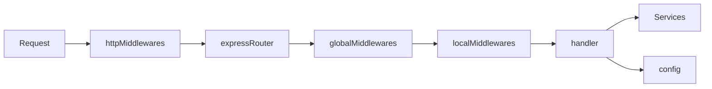
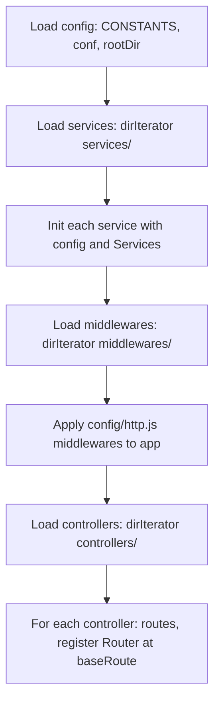

# Grogu.js Request Flow and Architecture

Detailed request flow and how the pieces fit together.

## Request flow



1. **Request** — Incoming HTTP request.
2. **httpMiddlewares** — Applied first, from `config/http.js` (e.g. body-parser, compression, cors). Same for all routes.
3. **expressRouter** — Router for the controller’s base path (e.g. `/Public`). Mounted with `app.use("/Public", expressRouter)`.
4. **globalMiddlewares** — If the controller exports `globalMiddlewares`, they run for every route under that base path before the router’s route-specific logic.
5. **localMiddlewares** — Per-route middlewares (by name). Injected with `{ Services, config }` as last argument.
6. **handler** — Route handler. Has access to `Services` and `config` via closure from `routes({ Services, config })`.
7. **Services / config** — Used inside handler (and middlewares) for business logic and configuration.

## Bootstrap (startup) flow



- **Config** — Built once: `{ CONSTANTS, ...conf, rootDir }`. apiVersions read from `config/apiVersions.js` separately.
- **Services** — All service modules loaded, then each called with `{ config, Services }` and awaited. Result stored in `Services` by PascalCase name.
- **Middlewares** — Loaded by filename; stored in `Middlewares` object.
- **HTTP middlewares** — Array from `config/http.js` applied with `app.use()`.
- **Controllers** — For each file, `routes({ Services, config })` returns route config; for each route, version prefix is applied, local middlewares resolved and injected, then `expressRouter[method](path, middlewares, handler)`. Router mounted at `/{baseRoute}`. Optional `globalMiddlewares` attached to same base path.

## File layout

```
app.js                 # Bootstrap: env, config, services, middlewares, http, controllers
utils.js               # dirIterator, getValidHttpMethod, fatalError, injectDependencyArgument, logger
config/
  apiVersions.js       # default, allowedVersions
  conf.js              # Merged into config
  constants.js         # config.CONSTANTS
  http.js              # Array of server-level middlewares
controllers/           # One file per controller; filename = base route
services/              # One file per service; async init with { config, Services }
middlewares/           # One file per middleware; injected with { Services, config }
models/                # (Optional) e.g. DB models
```

## Dependency injection summary

| Consumer    | Receives                    | How |
|------------|-----------------------------|-----|
| Controller | `Services`, `config`        | Arguments to `routes({ Services, config })`; use in closure for handlers. |
| Middleware | `Services`, `config`         | Last argument to middleware function via `injectDependencyArgument`. |
| Service    | `config`, `Services`         | Arguments to the exported init function at startup. |
